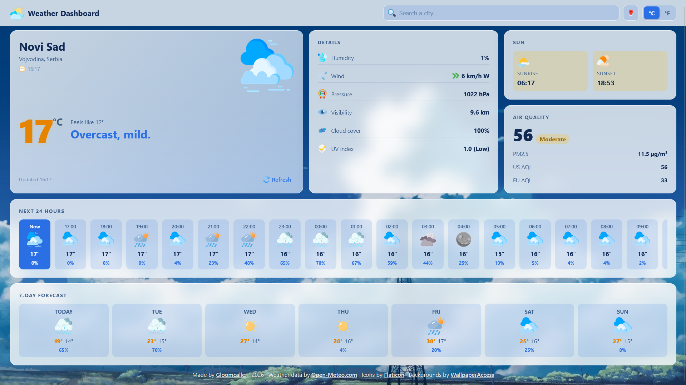
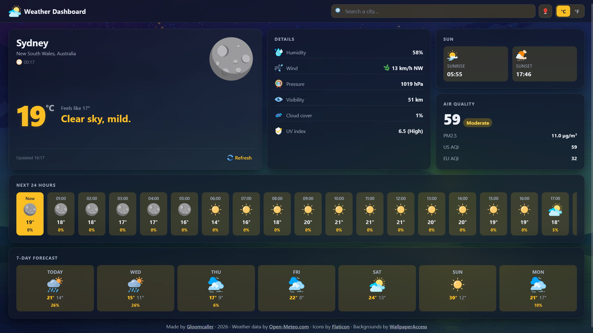

# Weather App

A responsive and interactive weather dashboard built with **HTML**, **SCSS**, **JavaScript**, and the **Open-Meteo API**.
This app allows users to search any city and view current conditions, hourly and 7-day forecasts, air quality, and more — no API key required.

## Overview

This project is a lightweight weather dashboard built for checking real-time conditions of any city in the world.
It is designed for developers and students looking to learn or integrate a clean weather UI into their own projects, or for anyone who just wants a fast, ad-free way to check the weather.

## Features

- **Live city search** with debounced autocomplete and disambiguation for ambiguous names.
- **Current conditions** with temperature, feels-like, and a descriptive mood sentence.
- **24-hour and 7-day forecasts** with day/night-aware icons.
- **Air quality card** showing PM2.5, US AQI, and EU AQI.
- **Details panel** for humidity, wind, pressure, visibility, cloud cover, and UV index.
- **Sun card** with sunrise and sunset in the searched city's local time.
- **Geolocation button** using the browser's location API with reverse geocoding.
- **Unit toggle** between °C/°F and km/h/mph, persisted in localStorage.
- **Automatic dark mode** based on the searched location's day/night status.
- **Weather-aware backgrounds** that crossfade between day and night variants.
- **Client-side caching** to reduce API calls and speed up repeat searches.
- **Fully responsive** – dashboard grid on desktop, single column on mobile.

## Screenshots

**Day Mode**  


**Night Mode**  


## Technologies Used

- **Frontend:** HTML5, SCSS, JavaScript (ES modules)
- **Weather API:** [Open-Meteo](https://open-meteo.com/) (keyless)
- **Reverse Geocoding:** [BigDataCloud](https://www.bigdatacloud.net/) (keyless)
- **Icons:** [Flaticon](https://www.flaticon.com/)

## Usage

Live version: **[https://your-deployed-url.com](https://your-deployed-url.com)**

1. Open the app in your browser.
2. Type a city name into the search bar, results appear as you type.
3. Pick the correct city if multiple matches appear.
4. View current conditions, details, air quality, and forecasts for that city.
5. Use the **location** button to get weather for your current position.
6. Toggle between **°C** and **°F** at any time, the choice is remembered.
7. Click **Refresh** to reload data, or wait, data is cached for 10 minutes.

## Local Setup

Want to run or tinker with it locally? ES modules require an `http://` origin, so opening `index.html` directly won't work.

```bash
git clone https://github.com/Gloomcaller/JS-Weather-App.git
cd JS-Weather-App
```

Serve it with any static server:

```bash
python -m http.server 8000     # or: npx serve .
```

Then visit `http://localhost:8000`.

If you plan to edit styles, compile the SCSS source:

```bash
sass scss/main.scss main.css           # one-shot
sass --watch scss/main.scss main.css   # live reload
```

### Easier alternative — VS Code extensions

If you'd rather skip the terminal, two VS Code extensions do the same thing:

- **Live Server** — right-click `index.html` → *Open with Live Server*. Handles the `http://` origin automatically.
- **Live Sass Compiler** — compiles `scss/main.scss` to `main.css` on save. Point its output to `main.css` in the project root, then just refresh.

No API key is required. Open-Meteo is free and keyless.

## Data Attribution

Weather data is provided by [Open-Meteo.com](https://open-meteo.com/) under the
[CC BY 4.0](https://creativecommons.org/licenses/by/4.0/) licence.

Reverse geocoding is provided by [BigDataCloud](https://www.bigdatacloud.net/).

Icons are provided by [Flaticon](https://www.flaticon.com/).

Backgrounds are provided by [WallpaperAccess](https://wallpaperaccess.com/).

## License

This project is licensed under the **MIT License**.
See the [LICENSE](LICENSE) file for more details.